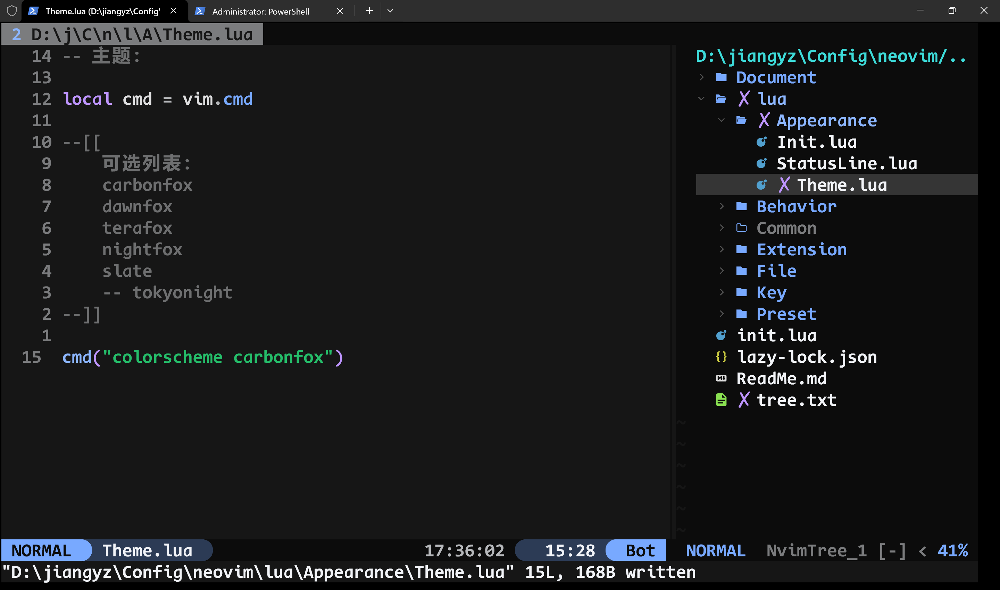
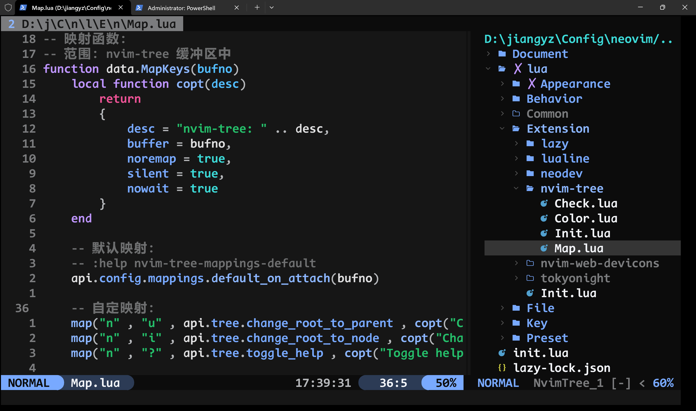

# NeoVim 配置

语言版本：

| [英文版 EnglishVersion](./Document/ReadMe.en.md) |

## 外观：

## 结构：

如上图右侧文件管理器所示

[完整目录结构](./tree.txt)

### 解释：

#### NeoVim 的默认结构：

    neovim 目录中的：
        init.lua 是启动文件
        lua 是搜索 lua 程序的默认目录

#### 目录(位于 lua 之下):

    Preset: 在正式加载前设置环境

    Common: 共用功能

    Behaviour: 行为，如：Tab能跳多远，Shift能移动多长，搜索是否采用渐进方式...
    File: 文件，如：怎样识别、解析、解释... 文件
    Key: 键，如：定义按键映射

    Appearance: 外观，如：界面：内容、组件、主题、字体、图标...

    Extension: 存放各个插件的配置

#### 如何：

    我如何创建这个结构的？

    以下列为基础：
        1. 功能域
        2. 开发便利性
        3. 语义描述

#### 注意：

    为了跟随 NeoVim 的默认目录文件结构定义，
    以及跨平台（Windows , Linux) 的使用方便

    将主配置目录放置于：$Home/.config/neovim/
